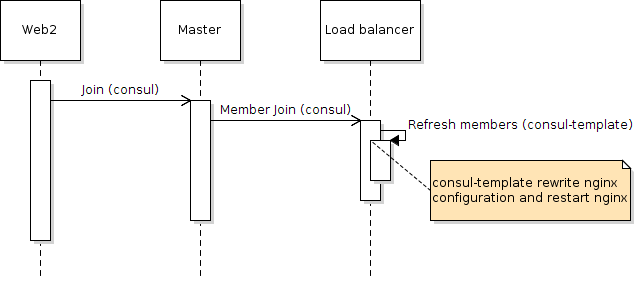

# Docker + Consul + Nginx

The test create a pool of three master nodes a load balancer for two web agent:

	  M        / W1
	/   \   LB - ...
	M - M      \ WN

* M = Master (consul server mode) - consul + ui
* LB = Load balancer (consul agent) - nginx + consul + consul template
* WN = Web (consul agent) - nginx + consul 

## Requirements

Below the specifications where it example was tested:

1. OS: Linux Mint 17.2 Rafaela
	1. Kernel: 3.16.0-38-generic #52~14.04.1-Ubuntu 
	2. Architecture: x86_64
2. Docker: version 1.7.1, build 786b29d
	1. docker image: ubuntu:latest
3. consul: 0.5.2_linux_amd64
4. consul-template: 0.10.0_linux_amd64

## How to works



## Build and run

Build dockers
	
```shell
./build.sh
```

Execute the example

```shell
./run
``` 

## Directories

* base, 
	* docker: makensi/microservices:example-base
	* include:
		* nginx
		* consul
		* supervisor
* server, 
	* docker: makensi/microservices:example-server
		* inheritance: makensi/microservices:example-base
	* include:
		* consul
		* nginx
* loadbalancer, 
	* docker: makensi/microservices:example-nginx-proxy
		* inheritance: makensi/microservices:example-base
	* include:
		* consul
		* consul-template
		* supervisor
* web, 
	* docker: makensi/microservices:example-nginx
		* inheritance: makensi/microservices:example-base
	* include:
		* consul

## Ports 

Once the example is running these is the list of available ports:

1. dns - 8600 - not bound to 53 because I am using dnsmasq locally.
2. http - 8500
3. rpc - 8400
4. lan - 8301
5. wan - 8302
6. rpc - 8300
7. ui - 8200
8. web - 8100

# DNS check

Once executed `run.sh` you can check the dns interface of consul using dig (dnsutils package):


```shell
dig @localhost -p 8600 web.service.consul
dig @localhost -p 8600 loadbalancer.service.consul
dig @localhost -p 8600 consul.service.consul
```
